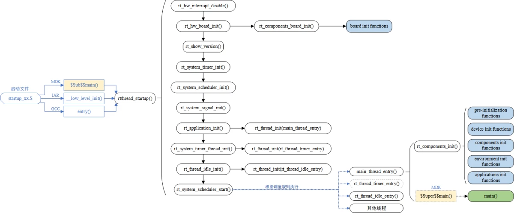
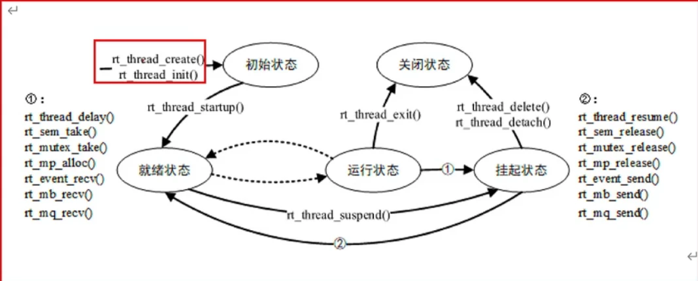

# DAY2笔记
今天上午主要学习了RT_Thread作为实时系统的特性、多线程的概念，以及RT_Thread的启动流程。下午主要是多线程的应用、嵌入式开发流程以及github的使用。

## 实时系统

### 概念

实时系统是指在确定的时间内完成规定功能，并能对外部异步事件做出正确响应的计算机系统。

### 分类

分为硬实时系统、软实时系统。

### 特性

1. 在不同的系统负载下，行为可以预测
2. 支持基于优先级的调度

#### Linus与RTOS

Linux是一个通用操作系统，其在嵌入式系统中的应用通常包含外设驱动支持、文件系统、网络连接和UI支持。

- 资源消耗大；

- 并不是实时的；

- 所有的Linux的功能都能在RTOS中提供，并能根据需求裁剪。
##RT_Thread
### 初始化流程




## 线程管理

### 是什么

线程调度用来处理多任务同时运行的情况，在硬件资源有限的裸机嵌入式设备中，单核CPU一段时间内只能处理一个事件，导致其他事件被延误，从而使得设备不具有实时性。实时操作系统能够解决这种问题。

#### 系统线程-空闲线程

		空闲线程是系统创建的**最低优先级**的线程，线程状态**永远为就绪态**。当系统中**无其他就绪态线程**存在时，调度器将调度到空闲线程。它通常是一个**死循环**，且永远**不能被挂起**。
		空闲线程在 RT-Thread 中有着特殊的用途:

1. 若某线程运行完毕，系统将**自动删除线程**:自动执行 rt_thread_exit()函数，先将该线程从系统就绪队列中删除，再将该线程的状态更改为关闭状态，不再参与系统调度，然后挂入rt_thread_defunct 的僵尸队列（资源未回收、处于关闭状态的线程队列 ）中，最后由空闲线程回收被删除线程的资源。
2. 空闲线程也提供了接口来运行用户设置的**钩子函数**，在空闲线程运行时会调用该钩子函数，适合**钩入功耗管理、看门狗喂狗等工作**。空闲线程必须有得到**执行的机会**，即其他线程不允许一直while(1)死卡，必须调用具有**阻塞性质的函数**;否则例如线程删除、回收等操作将无法得到正确执行。

### 怎么实现

通过多优先级，优先处理某些事件。以及相同优先级的线程之间通过时间片轮询的调度算法进行调度。

#### 线程控制块

由结构体struct rt_thread_t 来表示，用于管理线程，存放一些信息，比如优先级、线程名称、线程状态等。

#### 线程属性

##### 线程栈

可以在 finsh界面输出指令list thread获取已创建线程的状况。可以根据线程栈最大使用 比例来判断设置的线程栈是否合理，以便调整。

##### 线程状态

1. 初始状态：刚开始创建还没开始运行，不参与调度。——RT_THREAD_INIT
2. 就绪状态：按照优先级排队，等待被执行；在当前线程运行完毕就会让出处理器，操作系统会立刻寻找最高优先级的就绪态线程运行。——RT_THREAD_READY
3. 运行状态：线程当前正在运行。——RT_THREAD_RUNNING
4. 挂起状态：可能因为资源不可用挂起等待，或者线程主动延时一段时间而挂起。此时不参与调度。——RT_THREAD_SUSPEND
5. 关闭状态：线程运行结束将处于关闭状态。不参与线程的调度。——RT_THREAD_CLOSE

##### 线程优先级

数值越小的优先级越高。星火一号最大32支持个线程优先级。在一些资源比较紧张的系统中，可根据实际情况选择只支持8或32个优先级的系统配置。在Cortex-M系列中普遍采用32个优先级，最低优先级默认分配给空闲线程使用，当有比当前线程优先级更高的线程就绪时，当前线程立刻被换出，高优先级线程抢占处理器运行。

##### 时间片

只能在线程优先级相同的线程间起作用，采用时间片轮转的调度方式进行调度。设置的这个变量能够约束一个线程依次运行最大时长。

##### 注意：

作为一个优先级明确的实时系统，如果一个线程中的程序陷入死循环操作，那么比他优先级更低的线程都将不能够得到执行。因此在实时操作系统中必须注意要有让出CPU使用权的动作，如循环中**调用延时函数或者主动挂起（线程进入挂起状态）**。

#### 线程状态之间切换



### 线程相关操作

动态线程与静态线程的区别：动态线程是系统自动从内存堆上分配占空间与线程句柄（初始化堆之后才能使用create创建动态线程），静态线程是由用户分配栈空间与线程句柄。

#### 动态创建

##### 创建线程

调用rt_thread_create函数，并在main函数外编写线程入口函数（要主动挂起或延时来让系统能够进行空闲线程）。这时创建的线程处于RT_THREAD_INIT状态。

###### 线程创建函数要传的tick参数是什么？有什么作用？

当系统中存在相同优先级线程时，这个参数指定线程一次调度能够运行的最大时间长度。

###### 优先级相同的线程，系统怎么执行？

按在main函数中启动线程的顺序来执行，即队列先进先出。

##### 删除线程

注意：系统在线程执行的过程中会自动地释放使用过的内存，不建议在线程中调用删除线程。

##### 启动线程

调用rt_thread_startup函数处于RT_THREAD_READY状态。 

#### 静态创建

##### 创建线程

调用rt_thread_init函数，需要指定栈起始地址。

##### 脱离线程

调用rt_thread_detach函数，将线程对象从线程队列中移除出去。

#### 动态创建和静态创建的区别

实现机制一致，只是内存分配的方式不同。动态创建会在动态堆内存中分配一个线程句柄，而静态创建则是指定栈的大小和指定栈地址。

#### 创建线程需要对创建结果进行验证，并开启线程。

```c
rt_thread_t th1,th2 = RT_NULL;
th1 = rt_thread_create("th1", th1_entry, RT_NULL, 1024, 20, 5);
if(th1 == RT_NULL){
	LOG_E("thread th1 create failed...\n");
}
else{
	rt_thread_startup(th1);
	LOG_D("thread th1 create success!\n");
}
```

#### 线程辅助函数

##### 获取当前线程

通过函数rt_thread_self函数返回当前正在执行的线程（rt_thread_t类型的结构体指针）

##### 让出处理器资源

通过函数rt_thread_yield让出处理器资源，主动释放cpu的使用权。

##### 线程睡眠

 rt_thread_sleep或rt_thread_delay函数使当前线程进入挂起状态或者睡眠状态。