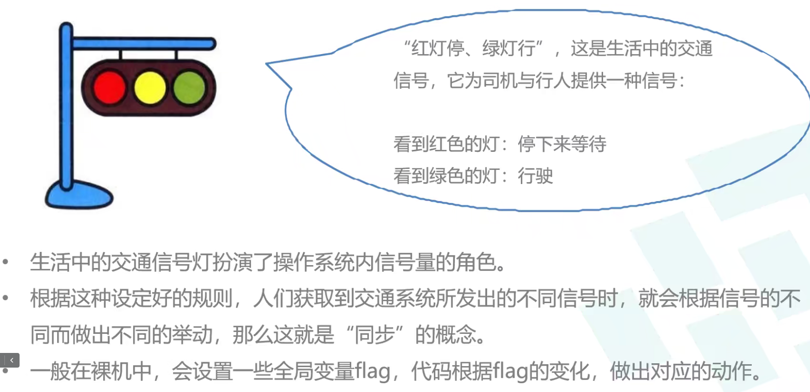
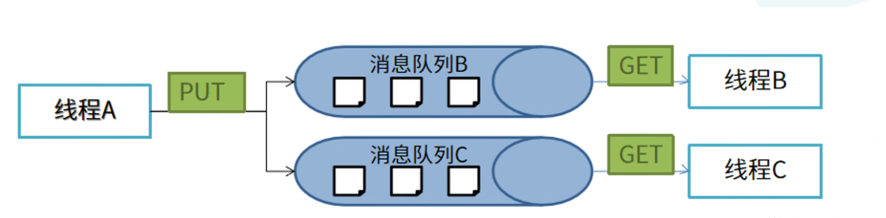
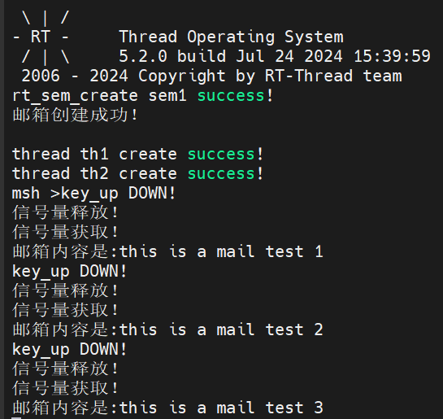

# DAY3笔记

今天上午学习了 RT_Thread的IPC的相关概念。比如线程间同步使用信号量、互斥量、事件量；线程间通信的方式：邮箱队列。下午学习了消息队列，以及线程间同步与线程间通信的软件包示例，并写了一段试验代码。


## 线程间同步

多个执行单元（线程、中断）同时执行临界区（多个执行单元会同时执行到的代码区域，包括软件、硬件资源），操作临界资源，会导致竞态产生，为了解决这种竞态问题，使得在系统运行时只能有一个线程被执行，本操作系统提供了如下几种同步互斥机制：

[^竞态]: **就是在多线程的编程中，你在同一段代码里输入了相同的条件，但是会输出不确定的结果的情况**。“竞态”的发生主要是因为多个线程都对一个共享变量有读取-修改的操作。在某个线程读取共享变量之后，进行相关操作的时候，别的线程把这个变量给改了，从而导致结果出现了错误。

- 信号量
- 互斥量
- 事件集

[^死锁]: 产生死锁必须同时满足一下四个条件，只要其中任一条件不成立，死锁就不会发生。1. **互斥条件**:只有对必须互斥使用的资源的争抢才会导致死锁(如哲学家的筷子、打印机设备)。像内存、扬声器这样可以同时让多个进程使用的资源是不会导致死锁的(因为进程不用阻塞等待这种资源)。2. **不剥夺条件**:进程所获得的资源在未使用完之前，不能由其他进程强行夺走，只能主动释放。请求和保持条件:进程已经保持了至少一个资源，但又提此时请出了新的资源请求，而该资源又被其他进程占有，求进程被阻塞，但又对自己己有的资源保持不放。3. **循环等待条件**:存在一种进程资源的循环等待链，链中的每一个进程已获得的资源同时被下一个进程所请求。请求和保持条件:进程已经保持了至少一个资源，但又提此时请出了新的资源请求，而该资源又被其他进程占有，求进程被阻塞，但又对自己己有的资源保持不放。4. **循环等待条件**:存在一种进程资源的循环等待链，链中的每一个进程已获得的资源同时被下一个进程所请求。


### 信号量

是一种轻型的用于解决线程间同步问题的内核对象，线程可以获取或释放它，从而达到**同步**或**互斥**的目的。可以用于任务与任务之间、任务与中断处理程序之间的同步与互斥。

每个信号量对象都有一个信号量值和一个线程等待队列，信号量的值对应了信号量的实例数目、资源数目。当信号量实例数目为零时，再申请该信号量的线程就会被挂起在该信号量的等待队列上，等待可用的信号量实例。 

#### 分类

1. 互斥信号量：一般不采用
2. 二值信号量
3. 

#### 生活类比



#### 为什么不直接采用全局变量flag作为信号量

由于**全局**变量不是操作系统API调用，所以使用全局变量不会引起任务的挂起和恢复。 而任务对事件的获知，一般需要不断查询该全局变量的值是否发生变化。 相对来说，使用**信号量**和**消息队列**进行任务间通信要比使用全局变量更加**安全**，对任务间通信联系变量的**隔离**要高。

#### 信号量结构体

rt_semaphore，也为rt_sem_t

```c
struct rt_semaphore
{
    struct rt_ipc_object parent;                      /**< inherit from ipc_object */
    rt_uint16_t          value;                       /**< value of semaphore. */
    rt_uint16_t          max_value;
    struct rt_spinlock   spinlock;
};
typedef struct rt_semaphore *rt_sem_t;
```

#### 信号量的使用和管理

##### 创建/初始化信号量

- 动态创建：`rt_sem_t rt_sem_create(const char *name, rt_uint32_t value, rt_uint8_t flag);`

  flag:

  RT_IPC_FLAG_FIFO         0x00      先进先出

  RT_IPC_FLAG_PRIO         0x01     优先级等待

- 静态创建：

  `rt_err_t rt_sem_init(rt_sem_t   sem, const char *name,  rt_uint32_t value,  rt_uint8_t  flag);`

##### 使用信号量

1. 获取信号量：rt_err_t rt_sem_take_interruptible(rt_sem_t sem, rt_int32_t timeout);
   **当信号量大于0时，线程才能获取到信号量资源**。获取成功后，对应信号量会减1。如果信号量等于0，则当前信号量资源不可获取，申请该信号量资源的线程将会根据time参数来选择**直接返回、挂起等待一段时间，或者永久等待**，直到该信号量的其他线程或中断**释放**该信号量。

2. 释放信号量：rt_err_t rt_sem_release(rt_sem_t sem);
   线程不再使用临界区时，要**释放**占用的信号量。释放信号量可以**唤醒**挂起在该信号量上的线程。尽管信号量在创建时制定了最大可获取数量，但是多次使用此函数也会导致**超出设置**的最大可获取数量。              

   |      timeout       | 值   | 含义        |
   | :----------------: | ---- | ----------- |
   | RT_WAITING_FOREVER | -1   | 永久等待    |
   |   RT_WAITING_NO    | 0    | 不等待      |
   |         n          | n    | 等待n个tick |

##### 删除/脱离信号量。

- `rt_err_t rt_sem_delete(rt_sem_t sem);`

- `rt_err_t rt_sem_detach(rt_sem_t sem);`

  脱离信号量就是让信号量对象从内核对象管理器中脱离，适用于静态信号量。

如果删除该信号量时，有线程正在等待该信号量，那么删除操作会下唤醒等待在该信号量上的线程（等待线程返回值是-RT_ERROR），然后再释放信号量的内存资源。

### 互斥量

体现的是排他性，是特殊的二值信号量。但是信号量可由不同的线程释放， 互斥量**只能由同一线程进行获取与释放**。互斥量是用来保护临界资源的。
与信号量不同，其支持：

1. 互斥量所有权：互斥量只能由同一线程进行获取与释放。

2. 递归访问

3. 防止优先级反转的特性：

   利用优先级继承协议(Sha,1990)。优先级继承是指，提高某个占有某种资源的低优先级线程的优先级，使之与所有等待该资源的线程中优先级最高的那个线程的**优先级相等（间接防止优先级最高的线程被抢占中等优先级的线程抢占）**，然后执行，而当这个低优先级线程释放该资源时，优先级重新回到初始设定。因此，继承优先级的线程避免了系统资源被任何中间优先级的线程抢占。

   [^优先级反转(Priority Inversion):]: 所谓优先级翻转，即当一个高优先级线程试图通过信号量机制访问共享资源时，如果该信号量已被一低优先级线程持有，而这个低优先级线程在运行过程中可能又被其它一些中等优先级的线程**抢占**，因此造成高优先级线程被许多具有较低优先级的线程阻塞，实时性难以得到保证。

#### 结构体

```c
struct rt_mutex
{
    struct rt_ipc_object parent;                      /**< inherit from ipc_object */
    rt_uint8_t           ceiling_priority;     /**< the priority ceiling of mutexe */
    rt_uint8_t           priority;    /**< the maximal priority for pending thread */
    rt_uint8_t           hold;               /**< numbers of thread hold the mutex */
    rt_uint8_t           reserved;                    /**< reserved field */
    struct rt_thread    *owner;                       /**< current owner of mutex */
    rt_list_t            taken_list;          /**< the object list taken by thread */
    struct rt_spinlock   spinlock;
};
typedef struct rt_mutex *rt_mutex_t;
```

#### 互斥量的使用和管理

##### 创建互斥量

- `rt_mutex_t rt_mutex_create(const char *name, rt_uint8_t flag);`
- `rt_err_t rt_mutex_init(rt_mutex_t mutex, const char *name, rt_uint8_t flag);`

##### 获取互斥量

rt_err_t rt_mutex_take(rt_mutex_t mutex, rt_int32_t timeout);

线程获取了互斥量，那么线程就有了对该互斥量的所有权，即某一个时刻一个互斥量只能被一个线程持有。

如果互斥量没有被其他线程控制，那么申请该互斥量的线程将成功获得该互斥量。

如果互斥量已经被当前线程控制，则该互斥量的持有计数加1，当前线程也不会挂起等待。

如果互斥量已经被其他线程占有，则当前线程在该互斥量上挂起等待，直到其他线程释放它或者等待时间超过指定的超时时间。

##### 释放互斥量

rt_err_t rt_mutex_release(rt_mutex_t mutex);

当线程完成互斥资源的访问后，应**尽快释放**它占据的互斥量，使得其他线程能及时获取该互斥量。

使用该函数接口时，只有已经拥有互斥量控制权的线程才能释放它，**每释放一次该互斥量，它的持有计数就减 1。当该互斥量的持有计数为零时(即持有线程已经释放所有的持有操作)，它变为可用**。

等待在该互斥量上的线程将被唤醒。

如果线程的运行优先级被互斥量提升，那么当互斥量被释放后线程恢复为持有互斥量前的优先级。

##### 删除互斥量

rt_mutex_delete

### 事件集

一个事件集可以包含多个事件，利用事件集可以完成一对多，多对多的线程间同步。

#### 一个线程和多个事件的关系：

其中任意一个事件唤醒线程，或几个事件都到达后唤醒线程，多个事件集合可以用一个uint32_t整型变量来表示。变量的每一位代表一个事件，线程通过“逻辑与”或“逻辑或”将一个或多个事件关联起来，形成事件组合。

#### RT_Thread定义的事件集有以下特点：

- 事件只与线程相关，事件间相互独立
- 事件仅用于同步，不提供数据传输功能
- 事件无排队性，即多次向线程发送同一事件(如果线程还未来得及读走)，其效果等同于只发送一次

#### 管理方法

事件集变量名为rt_event_t

```c
struct rt_event
{
    struct rt_ipc_object parent;                      /**< inherit from ipc_object */
    rt_uint32_t          set;                         /**< event set */
    struct rt_spinlock   spinlock;
};
typedef struct rt_event *rt_event_t;
```

##### 创建

`rt_event_t rt_event_create(const char *name, rt_uint8_t flag);`

`rt_err_t rt_event_init(rt_event_t event, const char *name, rt_uint8_t flag);`

##### 发送

`rt_err_t rt_event_send(rt_event_t event, rt_uint32_t set);`

发送事件函数可以发送事件集中的一个或多个事件。

使用该函数接口时，通过参数 set 指定的事件标志来设定 event 事件集对象的事件标志值，然后
遍历等待在 event 事件集对象上的等待线程链表，判断是否有线程的事件激活要求与当前 event
对象事件**标志值匹配**，如果有，则唤醒该线程。

##### 接收

`rt_err_t rt_event_recv(rt_event_t  event,  rt_uint32_t  set, rt_uint8_t  opt,  rt_int32_t  timeout, rt_uint32_t *recved);`

内核使用 32 位的无符号整数来标识事件集，它的**每一位代表一个事件**，因此一个事件集对象可同时等待接收 **32 个事件**，内核可以通过指定选择参数“逻辑与”或“逻辑或”来选择如何激活线程，使用“逻辑与”参数表示只有**当所有等待的事件都发生时才激活线程**，而使用“逻辑或”参数则表示**只要有一个等待的事件发生就激活线程**。

当用户调用这个接口时，系统首先根据 set 参数和接收选项 option 来判断它要接收的事件是否发
生，如果已经发生，则根据参数 option 上是否设置有 RT_EVENT_FLAG_CLEAR 来决定是否重置
事件的相应标志位，然后返回(其中 recved 参数返回接收到的事件):如果没有发生，则把等待
的 set 和 option 参数填入线程本身的结构中，然后把线程挂起在此事件上，直到其等待的事件满
足条件或等待时间超过指定的超时时间。如果超时时间设置为零，则表示当线程要接受的事件没有
满足其要求时就不等待，而直接返回-RT_ETIMEOUT。

##### 删除/脱离

`rt_err_t rt_event_delete(rt_event_t event);`

`rt_err_t rt_event_detach(rt_event_t event);`

## 线程间通信

### 消息邮箱

RT-Thread 操作系统的邮箱用于线程间通信，特点是开销比较低，效率较高。

邮箱中的每一封邮件只能容纳固定的 4 字节内容(针对 32 位处理系统，指针的大小即为 4个字节，所以一封邮件恰好能够容纳一个指针)。典型的邮箱也称作交换消息，线程或中断服务例程把一封4 字节长度的邮件发送到邮箱中，而一个或多个线程可以从邮箱中接收这些邮件并进行处理。

#### 结构体

```c
struct rt_mailbox
{
    struct rt_ipc_object parent;                      /**< inherit from ipc_object */
    rt_ubase_t          *msg_pool;            /**< start address of message buffer */
    rt_uint16_t          size;                           /**< size of message pool */
    rt_uint16_t          entry;                 /**< index of messages in msg_pool */
    rt_uint16_t          in_offset;        /**< input offset of the message buffer */
    rt_uint16_t          out_offset;      /**< output offset of the message buffer */
    rt_list_t            suspend_sender_thread;/**< sender thread suspended on this mailbox */
    struct rt_spinlock   spinlock;
};
typedef struct rt_mailbox *rt_mailbox_t;
```

#### 邮箱的使用与管理

##### 创建邮箱

`rt_mailbox_t rt_mb_create(const char *name, rt_size_t size, rt_uint8_t flag);`

`rt_err_t rt_mb_init(rt_mailbox_t mb, const char  *name,  void     *msgpool,    rt_size_t   size,	rt_uint8_t  flag);`

创建邮箱对象时会先从对象管理器中分配一个邮箱对象，然后给邮箱动态分配一块内存空间用来存
放邮件，这块内存的大小等于邮件大小(4 字节)与邮箱容量的乘积，接着初始化接收邮件数目和
发送邮件在邮箱中的偏移量。

- flag:

  RT_IPC_FLAG_FIFO         0x00      先进先出

  RT_IPC_FLAG_PRIO         0x01     优先级等待

##### 删除邮箱

`rt_err_t rt_mb_delete(rt_mailbox_t mb);`

`rt_err_t rt_mb_detach(rt_mailbox_t mb);`

当用 rt mb create() 创建的邮箱不再被使用时，应该删除它来释放相应的系统资源，一旦操作完成，邮箱将被永久性的删除。

删除邮箱时，如果有线程被挂起在该邮箱对象上，内核先唤醒挂起在该邮箱上的所有线程(线程返回值是 -RT ERROR)，然后再释放邮箱使用的内存，最后删除邮箱对象。

##### 发送邮件

`rt_err_t rt_mb_send(rt_mailbox_t mb, rt_ubase_t value);`

线程或者中断服务程序可以通过邮箱给其他线程发送邮件。

发送的邮件可以是 32 位任意格式的数据，一个整型值或者一个指向缓冲区的指针。当邮箱中的邮件已经满时，发送邮件的线程或者中断程序会收到 -RT EFULL 的返回值。

##### 等待方式发送邮件

`rt_err_t rt_mb_send_wait(rt_mailbox_t mb,  rt_ubase_t  value,  rt_int32_t  timeout);`

rt_mb_send_wait与 rt_mb_send的区别在于有等待时间，如果邮箱已经满了，那么发送线程将根据设定的 timeout 参数等待邮箱中因为收取邮件而空出空间。如果设置的超时时间到达依然没有空出空间，这时发送线程将被唤醒并返回错误码。

##### 发送紧急邮件

`rt_err_t rt_mb_urgent(rt_mailbox_t mb, rt_ubase_t value);`

##### 接收邮件

`rt_err_t rt_mb_recv(rt_mailbox_t mb, rt_ubase_t *value, rt_int32_t timeout);`

只有当接收者接收的邮箱中有邮件时，接收者才能立即取到邮件并返回 RT EOK 的返回值，否则接收线程会根据超时时间设置，或挂起在邮箱的等待线程队列上，或直接返回。

接收邮件时，接收者需指定接收邮件的邮箱句柄，并指定接收到的邮件存放位置以及最多能够等待的超时时间。如果接收时设定了超时，当指定的时间内依然未收到邮件时，将返回RT ETIMEOUT。

### 消息队列

在实际应用中我们常常遇到一些任务**需要和其他任务之间进行数据交流**，其实就是不同任务之间的消息传递。在一般的裸机系统中可以通过**全局变量**来实现不同应用程序之间的数据交互和消息传递。



#### 消息队列的创建与管理

##### 消息队列创建

`rt_mq_t rt_mq_create(const char *name, rt_size_t  msg_size, rt_size_t  max_msgs,  rt_uint8_t  flag);`

在创建消息队列指定的参数中，事件集标志参数决定了当消息不可获取时，多个线程等待的排
队方式。

## 软件包的使用

menuconfig.exe命令进入配置界面

pkgs --update能够对软件包进行更新

scons --dist能够将库复制到工程目录中

## 调试心得

1. 在调试时，活用断点能够在自己想要调试的代码部分进行调试。
2. 在调试时将重要的变量加入监视，能够更加清晰的梳理程序结构与错误点。
3. 在调试时，查看调试界面中的Registers能够对寄存器中的值进行获取，能够在单片机发生硬件错误时，了解在那些地方发生了错误。
4. 在调试界面的调用堆栈中，能够看到目前调试过程中已经处在哪些堆栈中，提高调试效率。
5. 在调试界面的Local与Gloal中能够查看局部变量与全局变量，更好的关注程序的执行。

## 实验代码

```c
/*
 * @Author: TanZHi 1802616312@qq.com
 * @Date: 2024-07-24 15:25:53
 * @LastEditors: TanZHi 1802616312@qq.com
 * @LastEditTime: 2024-07-24 16:37:53
 * @FilePath: \project\applications\main.c
 * @Description: 学习示例
 */

#include <board.h>
#include <rtthread.h>
#include <drv_gpio.h>
#include <rtdevice.h>
#include <rtdbg.h>
#include <string.h>
#define DBG_TAG "main"
#define DBG_LVL DBG_LOG

#define PIN_KEY_UP GET_PIN(C, 5)
#define KEY_OFF 1
#define KEY_ON  0

rt_thread_t th1,th2 = RT_NULL;
rt_sem_t sem1 = RT_NULL;
static rt_mailbox_t mail = RT_NULL;
static char mail_buffer[100];
char str1[] = "this is a mail test 1";/* 邮箱消息test1 */
char str2[] = "this is a mail test 2";/* 邮箱消息test2 */
char str3[] = "this is a mail test 3";/* 邮箱消息test2 */

/**
 * @description: 按键检测线程入口函数
 * @param {void} 
 * @return {*}
 */
void th1_entry(void *parameter){
    rt_err_t test;
    char *str;
    while (1)
    {
        if(!rt_pin_read(PIN_KEY_UP)){
            rt_thread_mdelay(20);
            if(!rt_pin_read(PIN_KEY_UP)){
                rt_kprintf("key_up DOWN!\n");
                rt_kprintf("信号量释放！\n");
                if(sem1->value == 0)rt_sem_release(sem1);
            }
        }

        test = rt_mb_recv(mail, (rt_uint32_t*)&str, RT_WAITING_NO);
        if(test == RT_EOK){
            rt_kprintf("邮箱内容是:%s\n", str);
            if (str == str3)
            break;
            strcpy(str, "");
        }
        rt_thread_mdelay(50);
    }
}

/**
 * @description: 邮箱接收信息并输出线程
 * @param {void} *parameter
 * @return {*}
 */
void th2_entry(void *parameter){
    uint8_t num = 0;
    while (1)
    {        
        uint8_t sem = rt_sem_take(sem1, RT_WAITING_FOREVER);
        if(sem == RT_EOK){
            rt_kprintf("信号量获取！\n");
            num++;
            switch (num)
            {
            case 1:
                if(rt_mb_send(mail, (rt_uint32_t)&str1))rt_kprintf("邮箱消息发送成功\n");
                break;
            case 2:
                if(rt_mb_send(mail, (rt_uint32_t)&str2))rt_kprintf("邮箱消息发送成功\n");
                break;
            case 3:
                if(rt_mb_send(mail, (rt_uint32_t)&str3))rt_kprintf("邮箱消息发送成功\n");
                num = 0;
                break;
            }            
        }
        rt_thread_mdelay(500);
    }
    rt_mb_delete(mail);
}

int main(void)
{
    sem1 = rt_sem_create("sem1", 1, RT_IPC_FLAG_FIFO);
    if(sem1 == RT_NULL){
        rt_kprintf("rt_sem_create sem1 failed...\n");
        return -1;
    }
    else if(sem1 != RT_NULL){
        rt_kprintf("rt_sem_create sem1 success!\n");
        rt_sem_take(sem1, RT_WAITING_NO);
    }
    
    mail = rt_mb_create("mail", 
                            10,  
                            RT_IPC_FLAG_FIFO);
    if (mail != RT_NULL)
        rt_kprintf("邮箱创建成功！\n\n");

    rt_pin_mode(PIN_KEY_UP, PIN_MODE_INPUT_PULLUP);//设置UP按键为上拉输入模式

    th1 = rt_thread_create("th1", th1_entry, NULL, 1024, 20, 5);
    if(th1 == NULL){
        rt_kprintf("thread th1 create failed...\n");
    }
    else{
        rt_thread_startup(th1);
        rt_kprintf("thread th1 create success!\n");
    }
    th2 = rt_thread_create("th2", th2_entry, NULL, 1024, 20, 5);
    if(th2 == NULL){
        rt_kprintf("thread th2 create failed...\n");
    }
    else{
        rt_thread_startup(th2);
        rt_kprintf("thread th2 create success!\n");
    }
}

```

