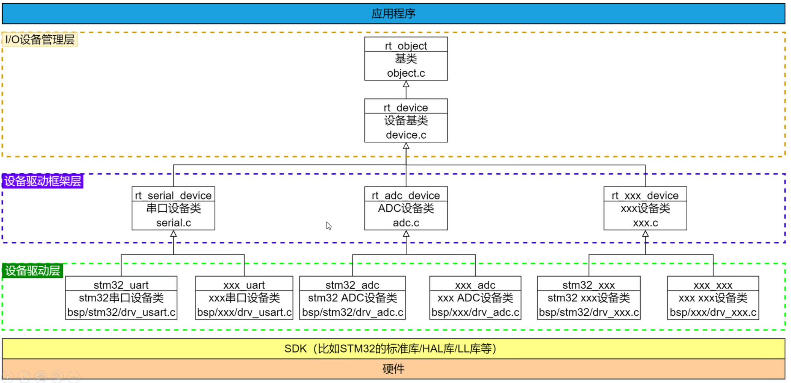

# DAY4笔记

不同的品牌芯片的硬件框架不同，在需要更换mcu时，会遇到一些问题：

1. 学习成本高:同一个工程师需要时间去学习不同厂家的API设计
2. 代码复用率低:都是SPI的代码驱动设备，没有办法做到代码复用

那有没有什么办法统一解决这种问题呢?
不同的厂家同一外设开发逻辑和 API相同?
驱动代码和驱动设备代码分离?

## 设备驱动框架



## IO设备模型

IO设备模型框架位于硬件和应用程序之间，共分为三层，从上到下分别是IO设备管理层、设备驱动框架层、设备驱动层。

应用程序通过IO设备管理器提供的接口来使用硬件，在IO设备管理器中驱动硬件。

#### IO设备类型

#### 创建和注册IO设备

##### 创建

`rt_device_t rt_device_create(int type, int attach_size);`

驱动层负责创建设备实例（结构体），并注册到IO设备管理器中。

##### 销毁

动态创建的设备不再需要使用时可通过rt_device_destroy来销毁

##### 注销

设备注销不会释放设备控制块占用的内存

##### 访问硬件

re_device_ops结构体的操作方法集中提供了标准的访问接口，比如初始化、打开、关闭、读写、控制等接口。

##### 注册

普通设备可通过rt_device_register来注册。对于已经具有相应驱动框架的复杂设备，比如看门口定时器，可通过rt_hw_watchdog_register来注册

#### 访问IO设备

## SPI驱动流程梳理

### 挂载SPI设备

SPI 驱动会注册 SPI 总线，SPI 设备需要挂载到已经注册好的 SPI 总线上。

调用函数

```c
rt_err_t rt_spi_bus_attach_device_cspin(struct rt_spi_device *device,
                                        const char           *name,
                                        const char           *bus_name,
                                        rt_base_t            cs_pin,
                                        void                 *user_data)

```

对一个SPI设备挂载到指定的SPI总线上，并向内核注册SPI设备，并绑定对应SPI的片选引脚。

### 配置SPI设备

挂载 SPI 设备到 SPI 总线后需要配置 SPI 设备的传输参数。

```ｃ
rt_err_t rt_spi_configure(struct rt_spi_device *device,
                          struct rt_spi_configuration *cfg)

```

`rt_spi_configuration`结构体能够配置SPI的模式、数据宽度、最大频率与保留。

### 查找SPI设备

在使用 SPI 设备前需要根据 SPI 设备名称获取设备句柄，进而才可以操作 SPI 设备，查找设备函数如下所示，

`rt_device_t rt_device_find(const char* name);`

### 访问SPI设备

应用程序使用 SPI 设备管理接口来访问 SPI 从机器件，主要接口如下所示：

| **函数**                  | **描述**                              |
| ------------------------- | ------------------------------------- |
| rt_device_find()          | 根据 SPI 设备名称查找设备获取设备句柄 |
| rt_spi_transfer_message() | 自定义传输数据                        |
| rt_spi_transfer()         | 传输一次数据                          |
| rt_spi_send()             | 发送一次数据                          |
| rt_spi_recv()             | 接受一次数据                          |
| rt_spi_send_then_send()   | 连续两次发送                          |
| rt_spi_send_then_recv()   | 先发送后接收                          |


### IO设备管理层、设备驱动框架层和设备驱动层的关系和调用流程

应用层通过设备管理层获取正确的设备驱动，然后通过这个设备驱动与底层I/O硬件设备进行数据或控制交互。

1. 设备管理层实现了对设备驱动程序的封装。对设备驱动框架层的管理。
2. 设备驱动框架层是对设备驱动硬件层的抽象。能够使得设备管理层对设备驱动框架层进行操作，从而操作设备驱动层。
3. 设备驱动层是一组驱使硬件设备工作的程序，实现访问硬件设备的功能。

对于SPI，如果是用户自己的SPI设备

1. 需要从设备驱动层向驱动框架层注册SPI设备
2. 然后从驱动框架层向设备管理层注册IO设备
3. 应用层需要查找SPI设备，并初始化。初始化完成后，将会在设备管理层、设备驱动框架层依次调用初始化函数，最终在设备驱动层初始化。